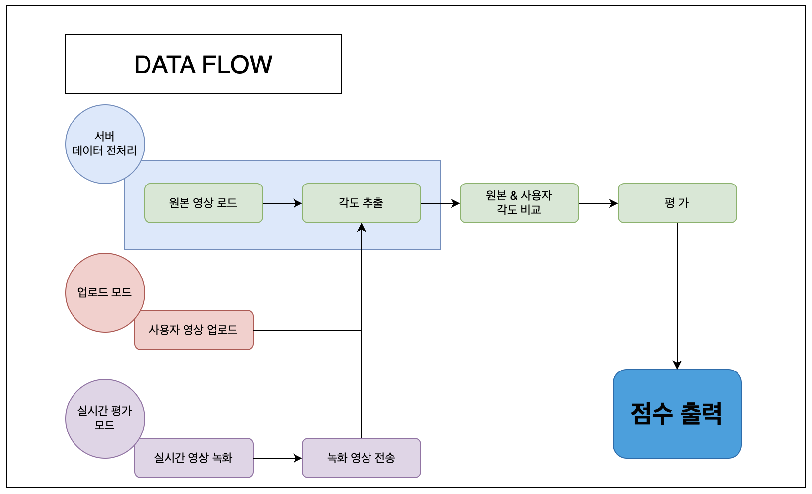
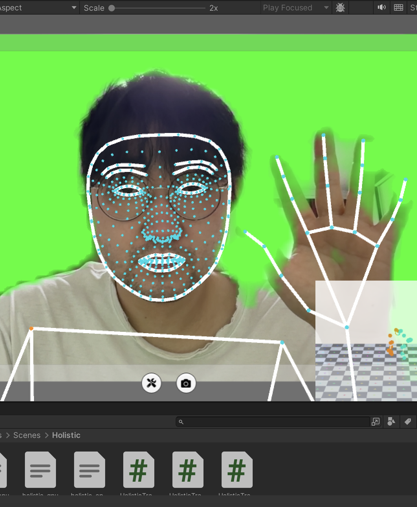
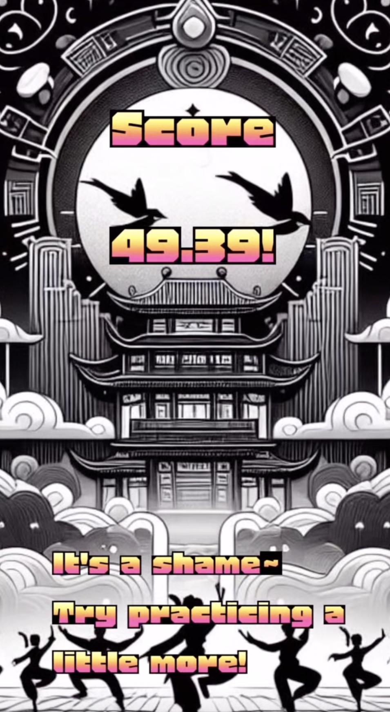

# G.O.D : Go Dance Up

---

## Flutter를 활용하여 딥러닝 모델을 탑재하여 춤을 평가해주는 앱 프로젝트
### Unity Avatar를 사용해 실시간으로 사용자의 모습을 따라하는 모드 추가

---
---

# 목 차
## 1. 프로젝트 소개
 * 스트레스와 우울감이 많은 현대인들에게 건전한 해소 방법을 제공 하는 앱
 * 어떤 것보다 흥미로운 운동을 할 수 있게 해주는 앱
 * 누구나 춤으로 자신만의 장기를 만들 수 있는 앱
 ## 남녀노소 누구나 노래방처럼 춤을 즐길 수 있는 댄스 앱!

---
---

## 2. 프로젝트 배경
 * 추후 연구자료 첨부 예정

---
---

## 3. 기술 스텍

---
---

## 4. Flow Chart

---
---

## 5. 사용 모델 & 모델 선정
* MediaPipe 'Blazepose model', OpenCV 'Canny model'

---
---

## 6. 핵심 기술 & Inferenece
* 좌측 이미지부터
1. pose estimation & angle extraction & evaluate score
2. Edge Detection & Floating
3. Edge video on Real-Time Device Cam
4. Unity MediaPipe 'holistic' Use on Flutter

---

---
---

## 7. Demo App (Image)
1. Upload mode

---

2. Streaming mode

---

3. Avatar mode

---
